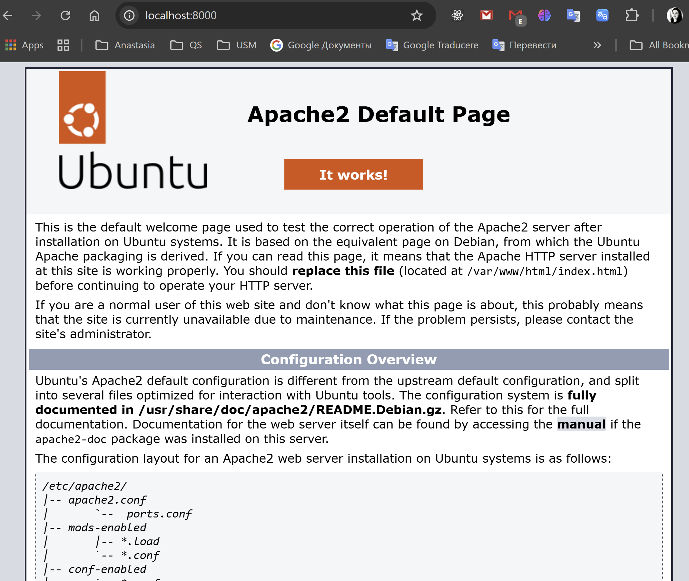
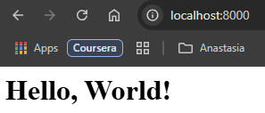
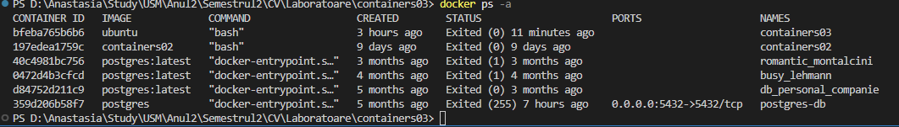
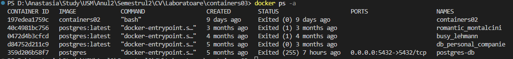

# containers03

## Scopul

Lucrarea de laborator are ca scop familiarizarea cu comenzile de bază ale OS Debian/Ubuntu. Mă familiarizez cu Docker și comenzile sale de bază.

## Sarcina

După ce am învățat despre Docker în cadrul cursului și laboratorului, am reușit să creez un container pe baza imaginii oficiale a sistemului de operare Ubuntu. În acest container, am instalat și configurat un server web Apache, iar apoi am creat o pagină web simplă care afișează mesajul "Hello, World!".

## Descrierea executării lucrării de laborator

### Descrierea lucrului cu Git-ul

1. M-am conectat la contul meu de GitHub.
2. Am dat click pe "New repository".
3. Am denumit repository-ul, am bifat să fie inițializat cu un fișier nou `README.md` și l-am creat.
4. Am clonat repository-ul în Visual Studio (VS) Code:
   - `git clone https://github.com/anastasiaCazacu/containers03.git` - clonez repository-ul.
   - `cd containers03` - accesez folderul clonat.
   - `git checkout -B lab03` - creez branchiul si ma mut pe el si modific fisierul meu README.MD si ulterior doar adaug continutul.
   - `git add *` - adaug tot continutul
   - `git status` - verific statutul
   - `git commit -m "structure defined"` - creez commitul
   - `git push origin lab03` - push commit în depozitul de la distanță
   - `git checkout main`- Comut pe branch-ul principal
   - `git merge lab03`- Integrez (merge) branch-ul nou în main.
   - `git push origin main` - Împing schimbările pe GitHub.

### Execuția

Vom executa următorii pași:

1. Mă asigur că Docker este instalat.
2. Rulez comanda:

   ```bash
   docker run -ti -p 8000:80 --name containers03 ubuntu bash
   ```

   Această comandă va crea și porni un container bazat pe imaginea Ubuntu, cu un terminal interactiv, mapează portul 8000 de pe gazdă la portul 80 din container și deschide un shell Bash în interiorul containerului.

3. În fereastra deschisă execut:

   - `apt update` - actualizează lista de pachete disponibile pe sistemul meu Ubuntu.
   - `apt install apache2 -y` - instalează Apache și toate dependențele necesare.
   - `service apache2 start` - pornește serverul Apache.
   - Accesez `http://localhost:8000` unde se afișează pagina Apache:
     

4. Execut următoarele comenzi:

   ```bash
   ls -l /var/www/html/
   ```

   Rezultatul afișat:

   ```bash
   total 12
   -rw-r--r-- 1 root root 10671 Mar  6 17:37 index.html
   ```

   Explicație:

   - `total 12` - ocupă 12 KB.
   - `-rw-r--r--` - permisiunile fișierului:
     - `rw-` - proprietarul poate citi și scrie.
     - `r--` - grupul poate doar citi.
     - `r--` - utilizatorii externi pot doar citi.

5. Rulez comanda:

   ```bash
   echo '<h1>Hello, World!</h1>' > /var/www/html/index.html
   ```

   Aceasta suprascrie fișierul `index.html` cu mesajul personalizat.
   

6. Vizualizez fișierul de configurare Apache:

   ```bash
   cd /etc/apache2/sites-enabled/
   cat 000-default.conf
   ```

   Rezultatul afișat:

   ```bash
   <VirtualHost *:80>
       ServerAdmin webmaster@localhost
       DocumentRoot /var/www/html
       ErrorLog ${APACHE_LOG_DIR}/error.log
       CustomLog ${APACHE_LOG_DIR}/access.log combined
   </VirtualHost>
   ```

   Explicație:

   - `<VirtualHost *:80>` - setează gazda virtuală pe portul 80.
   - `ServerAdmin webmaster@localhost` - email-ul administratorului.
   - `DocumentRoot /var/www/html` - directorul rădăcină pentru fișierele web.
   - `ErrorLog` și `CustomLog` - definesc fișierele de log.

7. Pentru ieșire, execut comanda:

   ```bash
   exit
   ```

8. Afisez liata de containere:

   ```bash
   docker ps -a
   ```

   Comanda `docker ps -a` afiseaza toate containerele Docker de pe sistemul meu, inclusiv cele pornite sau terminate. `docker`: Este instrumentul de linie de comandă utilizat pentru gestionarea containerelor Docker. `ps`: Listează containerele care rulează. `-a` (all): Afișează toate containerele, nu doar cele active.
   rezultatul: 

9. Sterg containerul:

   ```bash
   docker rm containers03
   ```

Comanda `docker rm containers03` este utilizată pentru a șterge un container Docker numit containers03.
Verificand containerul a fost sters cu succes deoarece era oprit. 

### Testarea

Am accesat `http://localhost:8000` și am verificat că pagina web creată afișează "Hello, World!".

## Concluzii

```markdown
Lucrarea de laborator mi-a permis să mă familiarizez cu conceptele de bază ale Docker, crearea și administrarea containerelor, precum și configurarea unui server Apache în interiorul unui container. Am reușit să creez și să testez o pagină web simplă folosind Apache într-un mediu izolat.
```
